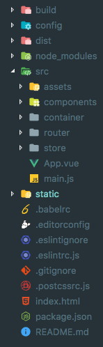
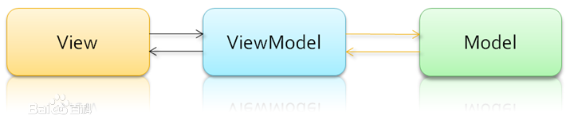

# 人人帮-前端

##注意：
注： 关于“人人帮”这个名字，名字是自己瞎起的，没有任何商业性活动，仅用作自己学习使用，如有冲突请联系删除。

## 使用方式

```shell
# 安装依赖
npm install
# 进入开发模式
npm run dev
# 编译打包
npm run build
```

 这里是 [线上demo](http://app.lee2me.xyz/) or [这里](http://47.95.214.71/)  

## 简介

### 技术栈

本应用本质是使用 HTML，CSS，JavaScript 来构建的 SPA（单页Web应用）。应用使用了前端工程化的编码方式，使用的主要工具如下

+ Vue.js : 前端 MVVM 框架
+ vue-router : 前端路由
+ vuex : 适用于 Vue.js 应用的状态管理库
+ Stylus : CSS预处理器
+ Webpack : 模块打包器(module bundler)
+ Element-UI : Vue组件库
+ axios : Fetch pollyfill
+ Cordova 移动开发框架


### 目录结构



这是前端项目的目录结构，大致介绍一下它们的功能

+ build 存放webpack的代码
+ config 存放webpack的配置
+ dist 编译打包后的页面
+ node_modules node依赖
+ src  项目的源代码
  + assets 需要被webpack分析打包的资源
  + components Vue 组件
  + container 由模块组成的一个个页面
  + router 前端路由配置
  + store Vuex的持久化状态管理仓库
  + App.vue 最外层的Vue 组件
  + main.js 入口文件
+ static 页面静态资源
+ index.html 最终要渲染的页面
+ package.json 依赖管理文件

### 技术细节 Q&A

#### Q: 什么是组件

组件可以扩展 HTML 元素，将HTML，CSS，JS 绑定在一起，封装可重用的代码。组件系统让我们可以用独立可复用的小组件来构建大型应用，几乎任意类型的应用的界面都可以抽象为一个组件树：

#### Q: 什么是MVVM

MVVM 是 Web 前端一种非常流行的开发模式，利用 MVVM 可以使我们的代码更专注于处理业务逻辑而不是去关心 DOM 操作。MVVM 的核心就是数据的双向绑定，即 View层 的操作直接通过一个 ViewModel 层 来改变 Model层 的数据，Model层 的数据发生改变时通过一个 ViewModel 层 来反映到 View层。它和MVC一样，主要目的是分离视图（View）和模型（Model）



#### Q: 为什么需要引入 Vuex

Vuex 实际上是 Flux 架构思想的一种实现，Flux将一个应用分成四个部分。

- **View**： 视图层
- **Action**（动作）：视图层发出的消息（比如mouseClick）
- **Dispatcher**（派发器）：用来接收Actions、执行回调函数
- **Store**（数据层）：用来存放应用的状态，一旦发生变动，就提醒Views要更新页面


---

Flux 的最大特点，就是数据的 "单向流动"。

    1. 用户访问 View
    2. View 发出用户的 Action
    3. Dispatcher 收到 Action，要求 Store 进行相应的更新
    4. Store 更新后，发出一个"change"事件
    5. View 收到"change"事件后，更新页面

上面过程中，数据总是"单向流动"，任何相邻的部分都不会发生数据的"双向流动"。这保证了流程的清晰。

---

于是使用它的优点就是下面这些

- 管理多个组件共享状态。
- 全局状态管理。
- 状态变更跟踪。
- 让状态管理形成一种规范，使代码结构更清晰。
